## Task2
```sql
CREATE DATABASE website;
```

```sql
USE website;
```


```sql
CREATE TABLE `member` (
    `id` BIGINT NOT NULL AUTO_INCREMENT PRIMARY KEY COMMENT 'Unique ID',
    `name` VARCHAR(255) CHARACTER SET utf8mb4 COLLATE utf8mb4_unicode_ci NOT NULL COMMENT 'Name',
    `username` VARCHAR(255) CHARACTER SET utf8mb4 COLLATE utf8mb4_unicode_ci NOT NULL COMMENT 'Username',
    `password`  VARCHAR(255) CHARACTER SET utf8mb4 COLLATE utf8mb4_unicode_ci NOT NULL COMMENT 'Password',
    `follower_count` INT UNSIGNED COMMENT 'Follower Count',
    `time` DATETIME NOT NULL DEFAULT CURRENT_TIMESTAMP COMMENT 'Signup Time'
);
```
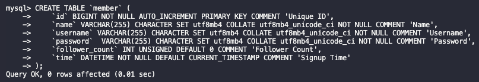

## Task3
```sql
INSERT INTO `member` (`name`, `username`, `password`, `follower_count`)
VALUES ('test', 'test', 'test', '10'),
	   ('Bob','Bob123','Bob456', '20'),
       ('Amy','Amy123','Amy456', '30'),
       ('Lily','Lily123','Lily456', '40'),
       ('Helen','Helen123','Helen456', '50');
```
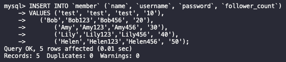
```sql
SELECT * FROM website.member;
```
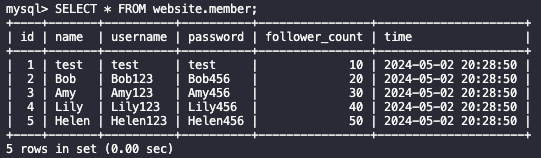
```sql
SELECT * FROM `member` ORDER BY `time` DESC;
```
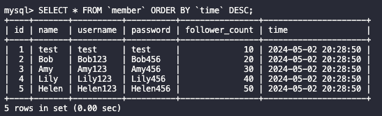
```sql
SELECT * FROM `member` ORDER BY `time` DESC LIMIT 1, 3;
```
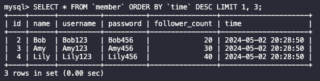
```sql
SELECT * FROM `member` WHERE `username` = 'test';
```
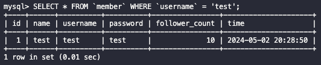
```sql
SELECT * FROM `member` WHERE `name` LIKE '%es%';
```
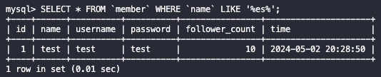

```sql
SELECT * FROM `member` WHERE `username` = 'test' AND `password` = 'test';
```
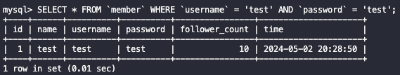
```sql
UPDATE `member` SET `name` = 'test2' WHERE `username` = 'test';
```


## Task4
```sql
SELECT COUNT(*) AS total_rows FROM `member`;
```
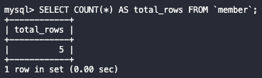
```sql
SELECT SUM(`follower_count`) AS total_followers FROM `member`;
```
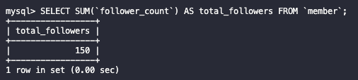
```sql
SELECT AVG(`follower_count`) AS average_followers FROM `member`;
```
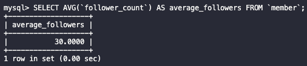
```sql
SELECT AVG(`follower_count`) AS average_followers_first_2
FROM (
    SELECT `follower_count`
    FROM `member`
    ORDER BY `follower_count` DESC
    LIMIT 2
) AS first_2_rows;
```


## Task5
```sql
CREATE TABLE `message` (
    `id` BIGINT NOT NULL AUTO_INCREMENT PRIMARY KEY COMMENT 'Unique ID',
    `member_id` BIGINT NOT NULL COMMENT 'Member ID for Message Sender',
    `content` VARCHAR(255) CHARACTER SET utf8mb4 COLLATE utf8mb4_unicode_ci NOT NULL COMMENT 'Content',
    `like_count` INT UNSIGNED NOT NULL DEFAULT 0 COMMENT 'Like Count',
    `time` DATETIME NOT NULL DEFAULT CURRENT_TIMESTAMP COMMENT 'Signup Time',
    FOREIGN KEY (member_id) REFERENCES member(id)
);
```
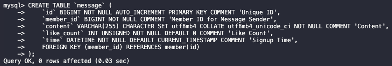
```sql
SELECT m.*,sender.name AS sender_name
FROM message m
JOIN member sender ON m.member_id=sender.id;
```
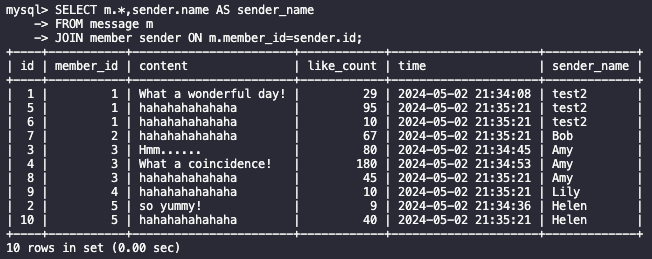
```sql
SELECT m.*, sender.name AS sender_name
FROM message m
JOIN member sender ON m.member_id = sender.id
WHERE sender.username = 'test';
```
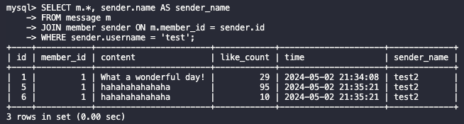
```sql
SELECT AVG(m.like_count) AS avg_like_count
FROM message m
JOIN member sender ON m.member_id = sender.id
WHERE sender.username = 'test';
```
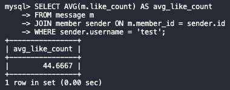
```sql
SELECT sender.username, AVG(m.like_count) AS avg_like_count
FROM message m
JOIN member sender ON m.member_id = sender.id
GROUP BY sender.username;
```
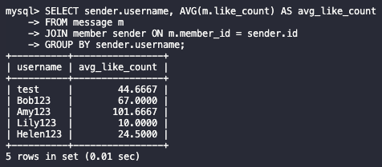